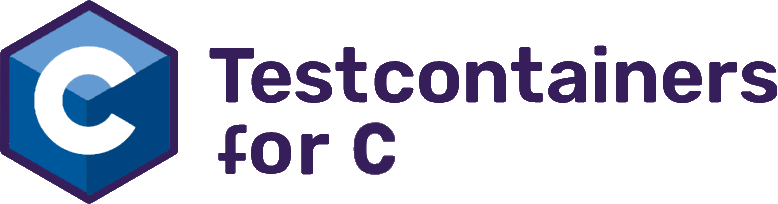

# Testcontainers for C/C++ and other native languages

<p align="center">
    <!--<a href="https://wiremock.org" target="_blank">-->
        
    <!--</a>-->
</p>

[](http://slack.testcontainers.org/)
[](https://masterminds.github.io/stability/experimental.html)
[](https://github.com/oleg-nenashev/testcontainers-c/releases)

!!! warning
    This is a prototype.
    There is a lot to do before it can be distributed and used in production, see the GitHub Issues
    and the [project roadmap](./ROADMAP.md)

This is not a standalone [Testcontainers](https://testcontainers.org/) engine,
but a C-style shared library adapter for native languages like C/C++, D, Lua, Swift, etc.
It is an MVP SDK that can be later extended for the languages.
The project is based on [Testcontainers for Go](https://golang.testcontainers.org/)
which is one of the most powerful Testcontainers implementations.

Contributions and feedback are welcome!
Also join the `#testcontainers-c` channel on the [Testcontainers Slack](http://slack.testcontainers.org/).

## Key Features

- Minimum viable Testcontainers API functionality:
  starting and terminating containers, passing files, exposing ports,
  accessing container logs, etc.
- Minimum HTTP client wrapper to simplify requests and assertions
- [Testcontainers for Go](https://golang.testcontainers.org/) under the hood
- Wrappers for native C types to minimize Golang conversion code on the user side
- Support for C and C++ projects. A fancy C++ wrapper is coming soon
- Support for Modules, e.g. the [WireMock module](./modules/wiremock/)

## Quick Start

In this section, we will build a demo C application that uses Testcontainers C/C++
for deploying a [WireMock](https://wiremock.org/) API server,
sends a simple HTTP request to this service,
and verifies the response.
We will not be using any C/C++ test framework for that.

For a test framework framework example, see the [Google Test sample project](./demo/google-test/).

### Build the project

Right now you have to check out and build the project to use it locally.
You will need CMake, Docker, Golang 1.19++, and recent C/C++ build tools.
The first build may take a while because the build process will need to download
[Testcontainers for Go](https://github.com/testcontainers/testcontainers-go)
and its dependencies like Docker client libraries,
and then repackage it as a shared library using `go build -buildmode=c-shared`.

```bash
cmake .
cmake --build .
ctest --output-on-failure
```

**Disclaimer:** The commands above may explode, proper coverage on different platforms is yet to be implemented.
At the moment the default compiler and linker options are used, so code is not very portable.
CMake's install option is not being tested at all, stay tuned for package managers.
Any patches and issue reports are welcome!

### Writing a first test

You can use a C/C++ framework for writing tests, e.g. CTest or CppUnit.
Or you can just have a small launcher as presented below.
Below there is a code of the [WireMock demo](./demo/wiremock/) that only uses the library
but not a specialized WireMock module (see below).

Note that in this example, we do not terminate the container,
because Testcontainers for Go injects [Moby Ryuk](https://github.com/testcontainers/moby-ryuk)
sidecar container by default to automatically terminate the instance.
We also do not worry about memory leaks too much, because the process will exit anyway.

#### main.c

<details>
<summary>
main.c - Show me the Code
</summary>

```c
#include <stdio.h>
#include <string.h>
#include "testcontainers-c.h"

#define DEFAULT_IMAGE "wiremock/wiremock:3.0.1-1"

int main() {
    printf("Using WireMock with the Testcontainers C binding:\n");

    printf("Creating new container: %s\n", DEFAULT_IMAGE);
    int requestId = tc_new_container_request(DEFAULT_IMAGE);
    tc_with_exposed_tcp_port(requestId, 8080);
    tc_with_wait_for_http(requestId, 8080, "/__admin/mappings");
    tc_with_file(requestId, "test_data/hello.json", "/home/wiremock/mappings/hello.json");
    struct tc_run_container_return ret = tc_run_container(requestId);
    int containerId = ret.r0;
    if (!ret.r1) {
        printf("Failed to run the container: %s\n", ret.r2);
        return -1;
    }

    printf("Sending HTTP request to the container\n");
    struct tc_send_http_get_return response = tc_send_http_get(containerId, 8080, "/hello");
    if (response.r0 == -1) {
        printf("Failed to send HTTP request: %s\n", response.r2);
        return -1;
    }
    if (response.r0 != 200) {
        printf("Received wrong response code: %d instead of %d\n%s\n%s\n", response.r0, 200, response.r1, response.r2);
        return -1;
    }
    printf("Server Response: HTTP-%d\n%s\n\n", response.r0, response.r1);
    return 0;
}
```

</details>

### Sample output

This is what a very simple run without a test framework may look like.

[](./demo/wiremock/)

### Installing the library

It is advised to include CMake as a dependent module for now.
If you like living dangerously until proper vcpkg and Conan packages are ready,
you can optionally install the library to your system:

```bash
# NOT RECOMMENDED
cmake --install ..
```

## Documentation

### Using in C/C++/Swift projects

- [C projects](./docs/c/README.md)
- [C++ projects](./docs/cpp/README.md)
- [Swift projects](./docs/swift/README.md)

See [the examples and demos](./demo/README.md) for more examples.

### Using in other languages

TL;DR: You get the C header file, a shared library object or a DLL file from the
[Testcontainers C](./docs/c/README.md) module,
Then, you know the drill.
Feel free to contribute examples or SDKs for the languages!

## Modules

As for other Testcontainers implementations, Testcontainers for C/C++ allow writing
extensions that extend the SDK and APIs to make usage of a particular service provider
easier.
The expectation is that the modules are implemented in a separate dynamic library
and linked to the consumer project.

### Available modules

- Generic container for DYI containers (embedded)
  - [Demo](./demo/generic-container/)
- [WireMock](./modules/wiremock/) - for API mocking and integration testing
  - [Demo](./demo/wiremock/)

### Why modules?

Modules help to simplify test development and maintenance by encapsulating
domain-specific logic of a target container.
For example, the WireMock module adds an API to simplify the configuration of the container.
You can also use modules to create specific asserts for the container,
or even attach full-fledged API clients for fine-grain testing.

Initializing WireMock with the module:

```c
#include "testcontainers-c-wiremock.h"

int main() {
    printf("Creating new container: %s\n", DEFAULT_WIREMOCK_IMAGE);
    int requestId = tc_wm_new_default_container();
    tc_wm_with_mapping(requestId, "test_data/hello.json", "hello");
    struct tc_run_container_return ret = tc_run_container(requestId);

    // ...
}
```

The same initialization without a module (using the "Generic Container" API):

<details>
<summary>
Show me the Code
</summary>

```c
#include "testcontainers-c.h"

#define DEFAULT_IMAGE "wiremock/wiremock:3.1.0-1"

int main() {
    printf("Using WireMock with the Testcontainers C binding:\n");

    printf("Creating new container: %s\n", DEFAULT_IMAGE);
    int requestId = tc_new_container_request(DEFAULT_IMAGE);
    tc_with_exposed_tcp_port(requestId, 8080);
    tc_with_wait_for_http(requestId, 8080, "/__admin/mappings");
    tc_with_file(requestId, "test_data/hello.json", "/home/wiremock/mappings/hello.json");
    struct tc_run_container_return ret = tc_run_container(requestId);

    // ...
}
```

</details>

### Creating new modules

You are welcome to contribute more modules in this or a standalone repository!

> **NOTE:** Some modules are stored in this repository for demo and prototyping purposes.
> If you develop new modules, once `vcpkg` or `Conan` packaging is implemented for Testcontainers C,
> you might want to develop your module in a standalone repository instead.

## Credits

Using a complex Golang framework from C/C++ is not trivial.
Neither the CMake files are.
This project would not succeed without many quality articles
and help from the community.

Kudos to:

- All Testcontainers, Golang C-Shared build mode, CGO and WireMock contributors!
- [Manuel de la Peña](https://github.com/mdelapenya) for maintaining [Testcontainers for Go](https://github.com/testcontainers/testcontainers-go) and answering bizarre questions about the implementations `:-)`
- [Vladimir Vivien](https://github.com/vladimirvivien) for
  [Calling Go Functions from Other Languages using C Shared Libraries](https://github.com/vladimirvivien/go-cshared-examples)
- [Ben McClelland](https://twitter.com/hpc_ben) for
   [An Adventure into CGO - Calling Go code with C](https://medium.com/@ben.mcclelland/an-adventure-into-cgo-calling-go-code-with-c-b20aa6637e75)
- [Insu Jang](https://github.com/insujang) for
  [Implementing Kubernetes C++ Client Library using Go Client Library](https://insujang.github.io/2019-11-28/implementing-kubernetes-cpp-client-library)
- Infinite number of StackOverflow contributors

## Read More

- [Testcontainers](https://testcontainers.org/)
- [WireMock and Testcontainers](https://wiremock.org/docs/solutions/testcontainers/)
- [Testcontainers Modules](https://testcontainers.com/modules)
- [WireMock modules for Testcontainers](https://testcontainers.com/modules/wiremock/)
