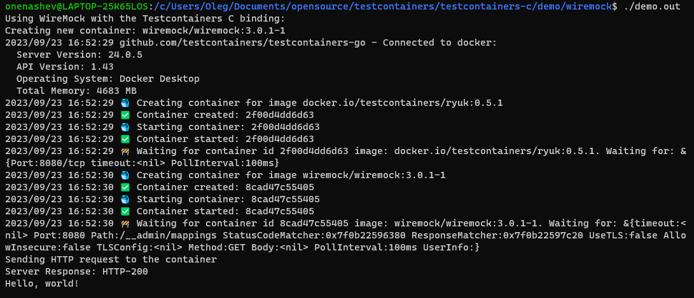

# Getting Started with Testcontainers for C/C++

In this section, we will build a demo C application that uses Testcontainers
in a simple C application
for deploying a [WireMock](https://wiremock.org/) API server,
sends a simple HTTP request to this service,
and verifies the response.
We will not be using any C/C++ test framework for that.

For test framework framework examples, see the [demos](../demo/README.md).

## Build the Project

Right now you have to check out and build the project to use it locally.
You will need CMake, Docker, Golang 1.22.5+, and recent C/C++ build tools.
The first build may take a while because the build process will need to download
[Testcontainers for Go](https://github.com/testcontainers/testcontainers-go)
and its dependencies like Docker client libraries,
and then repackage it as a shared library using `go build -buildmode=c-shared`.

```bash
cmake .
cmake --build .
ctest --output-on-failure
```

**Disclaimer:** The commands above may explode, proper coverage on different platforms is yet to be implemented.
At the moment the default compiler and linker options are used, so code is not very portable.
CMake's install option is not being tested at all, stay tuned for package managers.
Any patches and issue reports are welcome!

## Writing a First Test

You can use a C/C++ framework for writing tests, e.g. CTest or CppUnit.
Or you can just have a small launcher as presented below.
Below there is a code of the [WireMock demo](./demo/wiremock/) that only uses the library
but not a specialized WireMock module (see below).

Note that in this example, we do not terminate the container,
because Testcontainers for Go injects [Moby Ryuk](https://github.com/testcontainers/moby-ryuk)
sidecar container by default to automatically terminate the instance.
We also do not worry about memory leaks too much, because the process will exit anyway.

### main.c

<details>
<summary>
main.c - Show me the Code
</summary>

```c
#include <stdio.h>
#include <string.h>
#include "testcontainers-c.h"

#define DEFAULT_IMAGE "wiremock/wiremock:3.0.1-1"

int main() {
    printf("Using WireMock with the Testcontainers C binding:\n");

    printf("Creating new container: %s\n", DEFAULT_IMAGE);
    int requestId = tc_new_container_request(DEFAULT_IMAGE);
    tc_with_exposed_tcp_port(requestId, 8080);
    tc_with_wait_for_http(requestId, 8080, "/__admin/mappings");
    tc_with_file(requestId, "test_data/hello.json", "/home/wiremock/mappings/hello.json");
    struct tc_run_container_return ret = tc_run_container(requestId);
    int containerId = ret.r0;
    if (!ret.r1) {
        printf("Failed to run the container: %s\n", ret.r2);
        return -1;
    }

    printf("Sending HTTP request to the container\n");
    struct tc_send_http_get_return response = tc_send_http_get(containerId, 8080, "/hello");
    if (response.r0 == -1) {
        printf("Failed to send HTTP request: %s\n", response.r2);
        return -1;
    }
    if (response.r0 != 200) {
        printf("Received wrong response code: %d instead of %d\n%s\n%s\n", response.r0, 200, response.r1, response.r2);
        return -1;
    }
    printf("Server Response: HTTP-%d\n%s\n\n", response.r0, response.r1);
    return 0;
}
```

</details>

## Sample output

This is what a very simple run without a test framework may look like.

[](../demo/wiremock/README.md)
